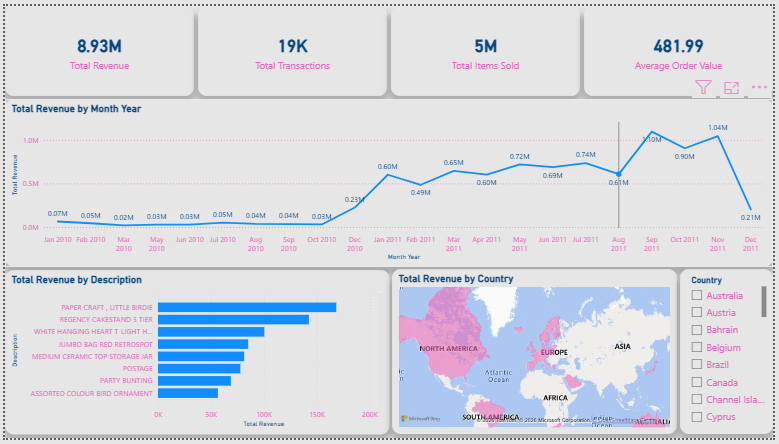
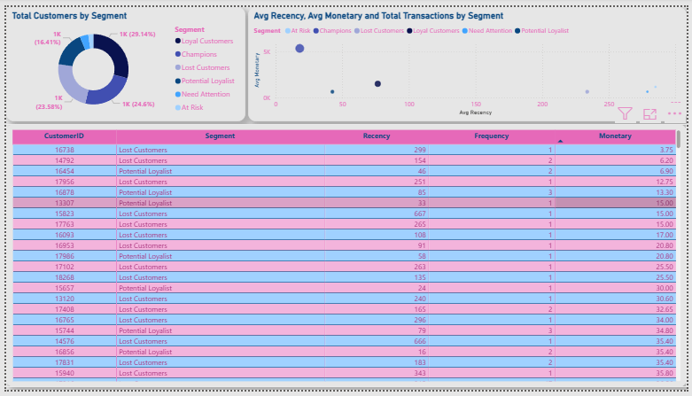
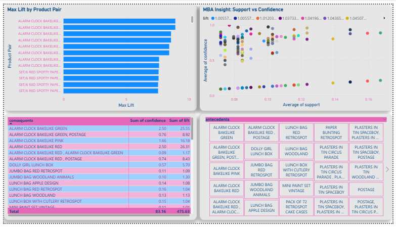

🛒 Online Retail End-to-End Data Pipeline & Analytics
🎯 Business Objective
This project aims to transform raw retail transaction data into actionable strategic insights through an automated data workflow. The primary focuses of this project are:

Data Integrity: Cleaning over 500k rows of transaction data, including handling returns and missing values.

Customer Retention: Identifying the most valuable customer segments and those at risk of churning using the RFM (Recency, Frequency, Monetary) method.

Sales Optimization: Discovering product purchase patterns (Market Basket Analysis) to drive effective bundling and cross-selling strategies.

🛠️ Tech Stack
Language: Python (Pandas, NumPy, Scikit-learn, MLxtend).

Database: PostgreSQL (Data Warehousing & Single Source of Truth).

ETL Tool: SQLAlchemy & pg8000 (Automated data loading from Python to SQL).

Visualization: Power BI (Interactive Dashboarding).

📂 Dataset Information
Due to GitHub's file size limitations, only a sample of the cleaned data is uploaded here. The full original dataset can be accessed below:

Source: [Online Retail Dataset](https://www.kaggle.com/datasets/sowndarya23/online-retail-dataset)

💡 Key Business Insights
Based on the dashboard analysis, here are the three key findings:

Seasonality Patterns: Total revenue reached $8.93M, with peak performance in November 2011 ($1.04M). It is recommended that management increase stock levels two months prior to this peak season.

Customer Loyalty: Loyal Customers (29.14%) and Champions (24.6%) dominate the customer base, indicating healthy retention but requiring continuous appreciation programs.

Bundling Strategy: Market Basket Analysis revealed that "Alarm Clock Bakelike" product variants have a Lift value of up to 8.9x, indicating a very strong correlation between different product colors.

📊 Dashboard Preview
1. Executive Sales Overview
Provides a macro view of business performance, including key KPIs (Revenue, Transactions, AOV) and global sales geographic distribution.

3. Customer Strategy (RFM)
Dissects customer profiles using RFM segmentation, featuring segment distribution via Donut Charts and Recency vs. Monetary correlations via Scatter Plots.

5. Product Affinity (Market Basket)
Utilizes association algorithms to identify products frequently bought together to support merchandising and cross-selling decisions.

